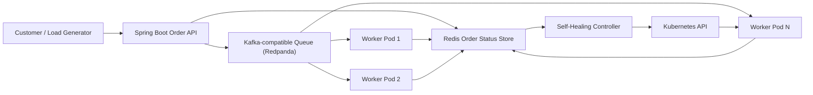

# Automated Chaos Testing and Self-Healing Microservices Platform

This project implements a DevOps pipeline and cloud-native runtime for a
delivery order processing system. Customers place delivery orders through a
Spring Boot REST API, order-processing tasks are queued in Kafka/Redpanda,
worker pods process them asynchronously, logs flow into ELK, LitmusChaos injects
failures, and Kubernetes plus a custom healing controller recover the system
automatically.

## Application Layer



## What It Demonstrates

- GitHub push triggers Jenkins pipeline.
- Jenkins fetches code, runs tests, builds Docker images, pushes Docker Hub
  images, and deploys to Kubernetes.
- Docker and Docker Compose support local integration testing.
- Kubernetes runs API, queue, Redis, worker, and healing services.
- HPA scales API and worker deployments under CPU load.
- Rolling updates deploy new versions without downtime.
- ELK collects JSON logs and visualizes submissions, failures, and healing
  actions.
- LitmusChaos injects pod deletion, CPU stress, and network delay.
- Vault stores credentials and injects them into pods.
- Ansible roles deploy app, Kubernetes infrastructure, monitoring, and Vault
  setup.

## Repository Layout

```text
services/order-api/            Spring Boot delivery order producer service
services/worker/               Kafka consumer and job processor
services/healing-controller/   Custom self-healing controller
libs/platform-common/          Shared models, logging, Redis repository, queue client
k8s/base/                      Kubernetes deployments, services, HPA, RBAC, PDB
chaos/experiments/             LitmusChaos ChaosEngine manifests
observability/                 ELK and Filebeat manifests/config
vault/                         Vault policy and bootstrap script
ansible/                       Modular Ansible roles
tools/load-generator/          Load generator for scale and chaos demos
docs/                          Report, architecture, demo, viva, rubric mapping
```

## Quick Local Demo

```bash
cd automated-chaos-testing-self-healing-microservices-platform
python3 -m pytest
docker compose up --build --scale worker=3
```

In another terminal:

```bash
curl -X POST http://localhost:8000/orders \
  -H "Content-Type: application/json" \
  -d '{"customerName":"Ayush","restaurantName":"Campus Canteen","pickupAddress":"Block A","deliveryAddress":"Hostel Gate","items":["Paneer Roll","Cold Coffee"],"priority":5,"estimatedDistanceKm":2.5,"simulateSeconds":2}'

python3 tools/load-generator/load_generator.py --jobs 50 --concurrency 10
curl http://localhost:8000/metrics
```

Kibana is available at:

```text
http://localhost:5601
```

Create a Kibana data view for:

```text
job-platform-logs-*
```

## Kubernetes Demo

Build and push images first:

```bash
export DOCKERHUB_ORG=your-dockerhub-username
export IMAGE_TAG=dev
make build
docker push "$DOCKERHUB_ORG/order-api:$IMAGE_TAG"
docker push "$DOCKERHUB_ORG/job-worker:$IMAGE_TAG"
docker push "$DOCKERHUB_ORG/healing-controller:$IMAGE_TAG"
```

Deploy:

```bash
kubectl apply -k k8s/base
kubectl -n job-platform port-forward svc/order-api 8000:8000
```

Generate load:

```bash
python3 tools/load-generator/load_generator.py --jobs 100 --concurrency 20
kubectl -n job-platform get hpa
```

## Chaos Demo

Install LitmusChaos and apply one experiment:

```bash
kubectl apply -f chaos/experiments/pod-delete-worker.yaml
kubectl -n job-platform get pods -w
kubectl -n job-platform logs deploy/healing-controller -f
```

Expected behavior:

1. Litmus deletes or stresses worker pods.
2. Kubernetes restarts failed pods.
3. HPA scales workers under CPU pressure.
4. The healing controller scales or restarts the worker deployment when backlog
   or failures cross thresholds.
5. ELK shows job failures, recovery actions, and completion events.

## Jenkins CI/CD

Configure Jenkins with:

- GitHub webhook: `http://<jenkins-host>/github-webhook/`
- Docker Hub credentials ID: `dockerhub-creds`
- Kubernetes access for the Jenkins agent

The included `Jenkinsfile` performs checkout, tests, Docker image build, Docker
Hub push, Kubernetes deployment, and rollout verification.

## Main Commands

```bash
make test
make compose-up
make compose-down
make build DOCKERHUB_ORG=your-name IMAGE_TAG=v1
make k8s-apply
make k8s-status
make load
make chaos-pod-delete
```

## Documentation

- [Architecture](docs/ARCHITECTURE.md)
- [Demo Guide](docs/DEMO_GUIDE.md)
- [Final Evaluation Runbook](docs/FINAL_EVALUATION_RUNBOOK.md)
- [Jenkins Runbook](docs/JENKINS_RUNBOOK.md)
- [Phase Implementation Map](docs/PHASE_IMPLEMENTATION.md)
- [Presentation Outline](docs/PRESENTATION_OUTLINE.md)
- [Project Report Draft](docs/PROJECT_REPORT.md)
- [Rubric Mapping](docs/RUBRIC_MAPPING.md)
- [Viva Questions](docs/VIVA_QUESTIONS.md)
