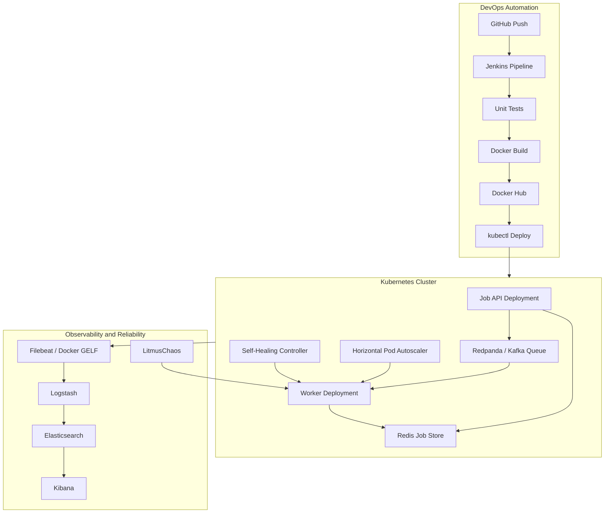

# Architecture

## Component View



## Runtime Flow

1. A client sends `POST /submit-job`.
2. Job API creates a job ID, stores status in Redis, and publishes the job to
   Kafka/Redpanda.
3. Worker pods consume jobs from the queue and update Redis with `running`,
   `completed`, or `failed`.
4. Logs are emitted as JSON and collected by ELK.
5. LitmusChaos injects pod deletion, CPU pressure, or network delay.
6. Kubernetes liveness probes, Deployment controllers, and HPA recover basic
   failures.
7. The custom healing controller reads job metrics from Redis and triggers
   scale/restart actions through the Kubernetes API.

## Self-Healing Rules

The controller evaluates this state every `HEALING_INTERVAL_SECONDS`:

```text
queued jobs + running jobs = backlog
failed jobs = failure count
current replicas = worker deployment replica count
```

Actions:

- Backlog above `HEALING_QUEUED_THRESHOLD`: scale worker replicas upward.
- Failed jobs above `HEALING_FAILED_THRESHOLD`: trigger a rolling restart.
- Backlog cleared: scale workers back to `HEALING_MIN_REPLICAS`.

Kubernetes also provides built-in recovery:

- Liveness probes restart unhealthy containers.
- Deployment controller recreates deleted pods.
- HPA scales pods when CPU utilization rises.
- Rolling update strategy keeps at least one old pod running during upgrades.

## Failure Scenarios

| Scenario | Injection | Expected Recovery |
| --- | --- | --- |
| Worker pod deleted | Litmus `pod-delete` | Deployment recreates pod |
| Worker CPU stress | Litmus `pod-cpu-hog` | HPA increases replicas |
| Network delay | Litmus `pod-network-latency` | Queue buffers jobs; workers resume |
| Many failed jobs | Flaky job payloads | Healing controller restarts workers |
| High job backlog | Load generator | Healing controller and HPA scale workers |

